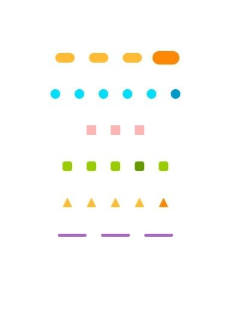

## PagerDotsIndicator
[](https://kotlinlang.org/)
[](LICENSE)
[](#)
---

**PagerDotsIndicator** is a lightweight, customizable Pager Dots Indicator for Android built with Kotlin.
Supports multiple shapes, animations, and full XML customization.

Designed to work with **ViewPager2**, or without ViewPager at all.

## ✨ Features

Fully customizable via **XML attributes** and **runtime methods**:

- Normal & selected dot colors
- Dot size & spacing
- Shape & animation selection
- Runtime updates supported

---

## Preview

<p align="center">
<table>
  <tr>
    <td align="center">
      
    </td>
    <td align="center">
      
    </td>
  </tr>
</table>
</p>

---


### 1️⃣ Add JitPack to your **root `settings.gradle` or `build.gradle`**

```gradle
dependencyResolutionManagement {
    repositories {
        google()
        mavenCentral()
        maven { url 'https://jitpack.io' }
    }
}
```
### Add Dependency
```
dependencies {
	        implementation 'com.github.Excelsior-Technologies-Community:PagerDotsIndicator:1.0.0'
	}
```
---

## Basic Usage

1️⃣ Add to XML
```xml
<com.ext.pagerdots.PagerDotsIndicator
    android:id="@+id/dotsIndicator"
    android:layout_width="wrap_content"
    android:layout_height="wrap_content"
    app:dotType="circle"
    app:animationType="scale"
    app:dotSize="8dp"
    app:dotSpacing="6dp"
    app:dotColor="#BDBDBD"
    app:selectedDotColor="#000000"/>
```

**Usage with ViewPager2 (Manual Attach)**

PagerDotsIndicator does not directly depend on ViewPager2.
You attach it manually — this gives you full control and flexibility.

```kotlin
val viewPager = findViewById<ViewPager2>(R.id.viewPager)
val dots = findViewById<PagerDotsIndicator>(R.id.dotsIndicator)

// Set dot count (number of pages)
dots.setDotCount(viewPager.adapter!!.itemCount)

// Sync dot selection with ViewPager
viewPager.registerOnPageChangeCallback(
    object : ViewPager2.OnPageChangeCallback() {
        override fun onPageSelected(position: Int) {
            dots.selectDot(position)
        }
    }
)
```

**How it works**

adapter.itemCount → total dots

onPageSelected(position) → selected dot

This works for images, fragments, videos, or any content.


**Usage WITHOUT ViewPager**

```
val dots = findViewById<PagerDotsIndicator>(R.id.dotsIndicator)

dots.setDotCount(4)
//dots.selectDot(0)

dots.postDelayed({ dots.selectDot(1) }, 1000)
dots.postDelayed({ dots.selectDot(2) }, 2000)
dots.postDelayed({ dots.selectDot(3) }, 3000)
```


---

## 🎨 Customization

### 🔷 Dot Shapes
Choose from multiple indicator shapes to match your app’s UI:

- **Circle**
- **Square**
- **Rounded Square**
- **Pill**
- **Line**
- **Triangle 🔺** *(Unique feature)*

Use `app:dotType` in XML to select the indicator shape.

| Shape            | XML Value        |
|------------------|------------------|
| Circle           | `circle`         |
| Square           | `square`         |
| Rounded Square   | `rounded_square` |
| Pill             | `pill`           |
| Line             | `line`           |
| Triangle 🔺      | `triangle`       |

---

### 🎬 Animations
Smooth animations for a modern user experience:

- **Scale**
- **Fade**
- **Slide**

Use `app:animationType` in XML to apply animation effects.

| Animation | XML Value |
|----------|-----------|
| None     | `none`    |
| Scale    | `scale`   |
| Fade     | `fade`    |
| Slide    | `slide`   |

---

### ⚙️ XML Attributes Support
Configure the indicator directly from XML without additional setup.

| Attribute            | Description                 |
|----------------------|-----------------------------|
| `dotSize`            | Size of each dot            |
| `dotSpacing`         | Space between dots          |
| `dotColor`           | Normal dot color            |
| `selectedDotColor`   | Selected dot color          |
| `dotType`            | Shape of dots               |
| `animationType`      | Selection animation         |

---

### 🚀 Runtime Control
Update indicators dynamically when page count or selected page changes.  
Works seamlessly **with or without ViewPager**.

```kotlin
dots.setDotColors(
    normal = Color.GRAY,
    selected = Color.BLUE
)
dots.setDotCount(newCount)
```

---

## License
```
MIT License

Copyright (c) 2025 Excelsior Technologies 

Permission is hereby granted, free of charge, to any person obtaining a copy
of this software and associated documentation files (the "Software"), to deal
in the Software without restriction, including without limitation the rights
to use, copy, modify, merge, publish, distribute, sublicense, and/or sell
copies of the Software, and to permit persons to whom the Software is
furnished to do so, subject to the following conditions:

The above copyright notice and this permission notice shall be included in all
copies or substantial portions of the Software.

THE SOFTWARE IS PROVIDED "AS IS", WITHOUT WARRANTY OF ANY KIND, EXPRESS OR
IMPLIED, INCLUDING BUT NOT LIMITED TO THE WARRANTIES OF MERCHANTABILITY,
FITNESS FOR A PARTICULAR PURPOSE AND NONINFRINGEMENT. IN NO EVENT SHALL THE
AUTHORS OR COPYRIGHT HOLDERS BE LIABLE FOR ANY CLAIM, DAMAGES OR OTHER
LIABILITY, WHETHER IN AN ACTION OF CONTRACT, TORT OR OTHERWISE, ARISING FROM,
OUT OF OR IN CONNECTION WITH THE SOFTWARE OR THE USE OR OTHER DEALINGS IN THE
SOFTWARE.
```


